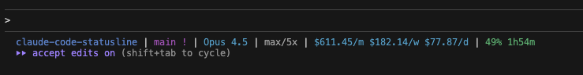

# Claude Code Statusline

A fast, lightweight statusline for [Claude Code](https://claude.ai/code) showing git info, API usage, costs, and more.



## Features

- **Git status**: branch, modified/staged/untracked indicators, ahead/behind
- **Model**: current Claude model in use
- **Subscription**: plan type and rate limit tier
- **Costs**: daily/weekly/monthly token costs from your usage logs
- **API usage**: current utilization % and time until reset

## Installation

### macOS / Linux

```bash
curl -fsSL https://raw.githubusercontent.com/erwint/claude-code-statusline/main/install.sh | bash
```

Or clone and install manually:

```bash
git clone https://github.com/erwint/claude-code-statusline.git
cd claude-code-statusline
./install.sh
```

### Windows (PowerShell)

```powershell
irm https://raw.githubusercontent.com/erwint/claude-code-statusline/main/install.ps1 | iex
```

Or download and run manually:

```powershell
Invoke-WebRequest -Uri https://raw.githubusercontent.com/erwint/claude-code-statusline/main/install.ps1 -OutFile install.ps1
.\install.ps1
```

### Build from source

Requires Go 1.21+:

```bash
go build -ldflags="-s -w" -o claude-code-statusline .
```

Force source build with the install script:

```bash
BUILD_FROM_SOURCE=1 ./install.sh
```

## Configuration

The install script automatically configures Claude Code by adding to `~/.claude/settings.json`:

```json
{
  "statusLine": {
    "type": "command",
    "command": "~/.claude/bin/claude-code-statusline"
  }
}
```

### Environment Variables

| Variable | Default | Description |
|----------|---------|-------------|
| `CLAUDE_STATUSLINE_CACHE_TTL` | `300` | Cache TTL in seconds for API usage |
| `CLAUDE_STATUS_DISPLAY_MODE` | `colors` | `colors`, `minimal`, or `background` |
| `CLAUDE_STATUS_INFO_MODE` | `none` | `none`, `emoji`, or `text` |
| `CLAUDE_STATUS_AGGREGATION` | `fixed` | Cost aggregation: `fixed` or `sliding` |

**Aggregation modes:**
- `fixed`: Calendar periods - today, this week (Mon-Sun), this month (1st onwards)
- `sliding`: Rolling windows - last 24h, last 7 days, last 30 days

### Command Line Flags

```
--cache-ttl <seconds>   Cache TTL for API usage (default: 300)
--no-color              Disable ANSI colors
--display-mode <mode>   colors|minimal|background
--info-mode <mode>      none|emoji|text
--aggregation <mode>    fixed|sliding (default: fixed)
--debug                 Enable debug logging to /tmp/claude-statusline.log
--version               Show version info
```

## How It Works

1. **Git info**: Runs `git` commands to get branch and status
2. **Model**: Receives current model via stdin from Claude Code
3. **Credentials**: Reads from `~/.claude/credentials.json`, falls back to system keychain
4. **API usage**: Fetches from Anthropic's OAuth API (cached)
5. **Costs**: Parses `~/.claude/projects/*/*.jsonl` logs (incremental, cached)

## Supported Platforms

Pre-built binaries are available for:

- macOS (Intel and Apple Silicon)
- Linux (x64 and ARM64)
- Windows (x64 and ARM64)

## Acknowledgments

Inspired by [gabriel-dehan/claude_monitor_statusline](https://github.com/gabriel-dehan/claude_monitor_statusline).

## License

MIT
