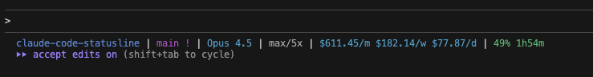

# Claude Code Statusline

A fast, lightweight statusline for [Claude Code](https://claude.ai/code) showing git info, API usage, costs, and more.



## Features

- **Git status**: branch, modified/staged/untracked indicators, ahead/behind
- **Worktree & PR**: worktree name and pull request number colored by review state
- **Model**: current Claude model, reasoning effort, and fast-mode indicator
- **Context window**: visual usage bar with color-coded thresholds
- **Subscription**: plan type and rate limit tier
- **Costs**: current session cost plus daily/weekly/monthly totals from your usage logs
- **API usage**: current utilization % and time until reset
- **Tool activity**: running tools with spinner, completed tool counts
- **Agent tracking**: subagent status with description and elapsed time
- **Todo progress**: current task and completion count
- **Session duration**: time since session started

## Installation

### Claude Code Plugin (Recommended)

In any Claude Code session:

```
/plugin marketplace add erwint/claude-code-statusline
/plugin install cc-statusline@cc-statusline
```

Restart Claude Code or run `/clear` to start a new session. The binary downloads automatically and the statusline appears.

If the statusline doesn't appear, run `/cc-statusline:setup` to manually install.

### macOS / Linux

```bash
curl -fsSL https://raw.githubusercontent.com/erwint/claude-code-statusline/main/install.sh | bash
```

Or clone and install manually:

```bash
git clone https://github.com/erwint/claude-code-statusline.git
cd claude-code-statusline
./install.sh
```

### Windows (PowerShell)

```powershell
irm https://raw.githubusercontent.com/erwint/claude-code-statusline/main/install.ps1 | iex
```

Or download and run manually:

```powershell
Invoke-WebRequest -Uri https://raw.githubusercontent.com/erwint/claude-code-statusline/main/install.ps1 -OutFile install.ps1
.\install.ps1
```

### Build from source

Requires Go 1.21+:

```bash
go build -ldflags="-s -w" -o claude-code-statusline .
```

Force source build with the install script:

```bash
BUILD_FROM_SOURCE=1 ./install.sh
```

## Configuration

The install script automatically configures Claude Code by adding to `~/.claude/settings.json`:

```json
{
  "statusLine": {
    "type": "command",
    "command": "~/.claude/bin/claude-code-statusline"
  }
}
```

### Environment Variables

| Variable | Default | Description |
|----------|---------|-------------|
| `CLAUDE_STATUS_CACHE_TTL` | `300` | Cache TTL in seconds for API usage |
| `CLAUDE_STATUS_DISPLAY_MODE` | `colors` | `colors`, `minimal`, or `background` |
| `CLAUDE_STATUS_INFO_MODE` | `none` | `none`, `emoji`, or `text` |
| `CLAUDE_STATUS_AGGREGATION` | `fixed` | Cost aggregation: `fixed` or `sliding` |
| `CLAUDE_STATUS_AUTO_UPDATE` | `true` | Enable automatic daily update checks |
| `CLAUDE_STATUS_DEBUG` | `false` | Enable debug logging to `/tmp/claude-statusline.log` |
| `CLAUDE_STATUS_CONTEXT` | `true` | Show context window usage bar |
| `CLAUDE_STATUS_TOOLS` | `true` | Show tool activity |
| `CLAUDE_STATUS_AGENTS` | `true` | Show agent activity |
| `CLAUDE_STATUS_TODOS` | `true` | Show todo progress |
| `CLAUDE_STATUS_DURATION` | `true` | Show session duration |
| `CLAUDE_STATUS_SESSION_COST` | `true` | Show cost of the current session |
| `CLAUDE_STATUS_EFFORT` | `true` | Show reasoning effort level |
| `CLAUDE_STATUS_PR` | `true` | Show pull request number and review state |
| `CLAUDE_STATUS_WORKTREE` | `true` | Show git worktree name |

**Aggregation modes:**
- `fixed`: Calendar periods - today, this week (Mon-Sun), this month (1st onwards)
- `sliding`: Rolling windows - last 24h, last 7 days, last 30 days

### Command Line Flags

```
--cache-ttl <seconds>   Cache TTL for API usage (default: 300)
--no-color              Disable ANSI colors
--display-mode <mode>   colors|minimal|background
--info-mode <mode>      none|emoji|text
--aggregation <mode>    fixed|sliding (default: fixed)
--auto-update           Enable automatic daily updates (default: true)
--debug                 Enable debug logging to /tmp/claude-statusline.log
--show-context          Show context window usage (default: true)
--show-tools            Show tool activity (default: true)
--show-agents           Show agent activity (default: true)
--show-todos            Show todo progress (default: true)
--show-duration         Show session duration (default: true)
--show-session-cost     Show cost of the current session (default: true)
--show-effort           Show reasoning effort level (default: true)
--show-pr               Show pull request number and review state (default: true)
--show-worktree         Show git worktree name (default: true)
--version               Show version info
--update                Download and install the latest version
```

**Auto-updates:** By default, the statusline checks for updates once per day (with ±2 hour jitter to avoid server load). If a new version is available, it automatically downloads and installs it in the background. You can disable this with `--auto-update=false` or `CLAUDE_STATUS_AUTO_UPDATE=false`.

## How It Works

1. **Git info**: Runs `git` commands to get branch and status
2. **Session data**: Receives model, context window, effort, session cost, PR, and worktree via stdin JSON from Claude Code
3. **Usage limits**: Read from the `rate_limits` field Claude Code provides on stdin. Older Claude Code versions don't send it, so the statusline falls back to Anthropic's OAuth API (cached, with backoff)
4. **Credentials**: Reads plan and tier from `~/.claude/credentials.json`, falls back to system keychain
5. **Costs**: The session figure comes from Claude Code directly. Daily/weekly/monthly totals are estimated by parsing `~/.claude/projects/*/*.jsonl` logs (incremental, cached) against `pricing.json`
6. **Activity**: Parses transcript JSONL for tools, agents, todos, and session start

### Pricing data

Anthropic publishes no pricing API, so `pricing.json` is generated from the [published pricing table](https://platform.claude.com/docs/en/about-claude/pricing) by `scripts/updatepricing`, cross-checked against LiteLLM's price map, and refreshed daily by a GitHub Action. Installed statuslines pick up changes within 24h.

Prices carry effective dates and are only ever appended, so a rate change is never applied to usage that was billed at the old rate. Cache writes are billed by TTL (5-minute at 1.25x input, 1-hour at 2x), and fast-mode requests at their own rate.

```bash
go run ./scripts/updatepricing          # refresh pricing.json
go run ./scripts/updatepricing -check   # fail if out of date
```

## Supported Platforms

Pre-built binaries are available for:

- macOS (Intel and Apple Silicon)
- Linux (x64 and ARM64)
- Windows (x64 and ARM64)

## Acknowledgments

Inspired by [gabriel-dehan/claude_monitor_statusline](https://github.com/gabriel-dehan/claude_monitor_statusline) and [jarrodwatts/claude-hud](https://github.com/jarrodwatts/claude-hud).

## License

MIT
